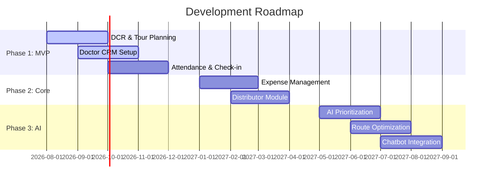

# Monetization & Roadmap

This document outlines pricing structures and the phase-by-phase development lifecycle.

---

## 1. Monetization Strategy (SaaS Pricing)

| Tier | Monthly Price (Per User) | Included Modules |
|------|-------------------------|------------------|
| **Basic** | $15 / user | SFA, Basic Doctor CRM, Basic Reports |
| **Pro** | $25 / user | SFA, Advanced CRM, Expense Control, HRMS |
| **Enterprise** | $45 / user | SFA + CRM + HRMS + AI Engine + BI Dashboard |
| **Enterprise Plus**| Custom Quote | Full platform + custom ERP connectors (SAP, Oracle) |

### Available Add-ons
- AI Demand Forecasting ($5 / user / month)
- WhatsApp Automated Notifications ($2 / user / month)

---

## 2. Phase-Wise Roadmap

